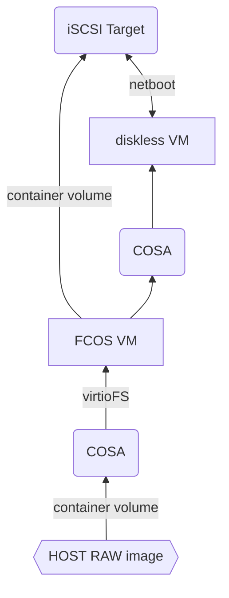

# CoreOS iscsi test setup

This repo contains a few bits needed to boot a coreOS VM from an iSCSI root disk. 
This is still a work in progress

## Overview



## target container

Targetcli in a container. It requires root privileges. 

### Build the image
```bash
# podman build -t targetcli -f Dockerfile .
```

### Run
If you want to run the container on its own (without through the ignition config provided), here is the required arguments: 
```bash
# podman run -d \
	--name targetclid \
	-v /lib/modules:/lib/modules \
    -v /sys/kernel/config:/sys/kernel/config \
	--privileged --cap-add=CAP_SYS_MODULE \
	--net host \
	quay.io/jbtrystram/targetcli
```
then `podman exec -it targetclid targetcli`, you can then create portals, luns and all iSCSI things.

Note: `--net host` is used here because `-p 3260:3260` made the LUN to bind to the container network address.


## CoreOS Virtual machine

Here we focus on running the iSCSI target container in a virtual machine created through [cosa](https://coreos.github.io/coreos-assembler/cosa/run/)

### Components
The `ignition` folders contains the necessary butane configuration to launch and configure everything:
 - `target.container` sets up the container explained above as a systemd service.
 - `setup-targetcli.service` sets up a systemd service to execute `targetcli_script`, only on the first boot and only once.  
 - `targetcli_script` is simply a bash script that execute `targetcli` commands inside the container to configure it.
 - `target.bu` ties it all together, essentially copying the above bits in the correct places.


### Pre-requisites

You will need a metal image of fedora coreOS and a regular image :
```
cosa fetch && cosa build && cosa buildextend-metal
```
Then, copy the metal raw file in the tmp workdir, expand it and make it writeable: 
```
cp builds/latest/x86_64/fedora-coreos-*.raw tmp/fcos.raw
chmod 664 temp/fcos.raw
```
Neatly, `cosa run` will mount `tmp/` at `/var/mnt/workdir-tmp` in the VM through virtioFS.

### Start the VM

Build the butane config:
```
 butane --pretty --strict target.bu -d . > target.ign
```

Then `cosa run -i /path/to/target.ign`

At this point, the iSCSI target setup is complete.

## Testing

Now, we create a second VM, which should boot from the iSCSI target.
We'll need an iPXE boot script: 
``` 
$ cat /mnt/workdir-tmp/boot.ipxe
#!ipxe
sanboot iscsi:10.0.2.15::::iqn.2023-10.coreos.target.vm:coreos
```

Then boot !
```
podman run -ti --privileged --net=host --rm -v /mnt/workdir:/mnt/workdir \
quay.io/coreos-assembler/coreos-assembler shell -- \
kola qemuexec --netboot /mnt/workdir/tmp/boot.ipxe --usernet-addr 10.0.3.0/24
```

At this point, you should get a GRUB screen, pulled from that initial `metal raw` file, booted off iscsi ! Happy hacking.

## Manual iscsi mount

The setup target in the ignition config is `iqn.2023-10.coreos.target.vm:coreos`. No auth is required. 
So on the initator, to mount the volume
Discover : 
```
# sudo  iscsiadm -m discovery -t st -p 10.0.2.15
10.0.2.15:3260,1 iqn.2023-10.coreos.target.vm:coreos
```
Mount :
```
sudo  iscsiadm -m node -T iqn.2023-10.coreos.target.vm:coreos -l
Logging in to [iface: default, target: iqn.2023-09.centos.vm:coreos, portal: 192.168.122.2,3260]
Login to [iface: default, target: iqn.2023-09.centos.vm:coreos, portal: 192.168.122.2,3260] successful.
```

Then find where it was mounted :  `journalctl --no-pager | grep "Attached SCSI"`
The core OS disk image : 
```
sudo blkid /dev/sdc*
/dev/sdc: PTUUID="a1c653e9-8857-4eb1-b69b-6f53952a569d" PTTYPE="gpt"
/dev/sdc1: PARTLABEL="BIOS-BOOT" PARTUUID="6498509e-b163-4660-b067-04ea5db88b1d"
/dev/sdc2: SEC_TYPE="msdos" LABEL_FATBOOT="EFI-SYSTEM" LABEL="EFI-SYSTEM" UUID="E45-2746" BLOCK_SIZE="512" TYPE="vfat" PARTLABEL="EFI-SYSTEM" PARTUUID="60f508bc-0dee-4355-b052-aae90650b550"
/dev/sdc3: LABEL="boot" UUID="78ec57df-7912-4cf1-b9c9-2a782bf6ea83" BLOCK_SIZE="1024" TYPE="ext4" PARTLABEL="boot" PARTUUID="3f1a5f26-36e1-4411-807c-b579d20d855d"
/dev/sdc4: LABEL="root" UUID="0f296b65-e139-4729-9890-c9312eb91bbd" BLOCK_SIZE="512" TYPE="xfs" PARTLABEL="root" PARTUUID="0a29aecb-1b5b-450b-9964-1760b3b72acf"
```

# Sources
https://access.redhat.com/documentation/en-us/red_hat_enterprise_linux/8/html/managing_storage_devices/configuring-an-iscsi-target_managing-storage-devices#installing-targetcli_configuring-an-iscsi-target

https://access.redhat.com/documentation/en-us/red_hat_enterprise_linux/8/html/managing_storage_devices/configuring-an-iscsi-initiator_managing-storage-devices

https://medium.com/oracledevs/kvm-iscsi-part-i-iscsi-boot-with-ipxe-f533f2666075

https://cleech.github.io/blog/2013/11/05/booting-virtual-machines-using-iscsi-part-2/

https://developers.redhat.com/blog/2019/04/24/how-to-run-systemd-in-a-container?source=sso
